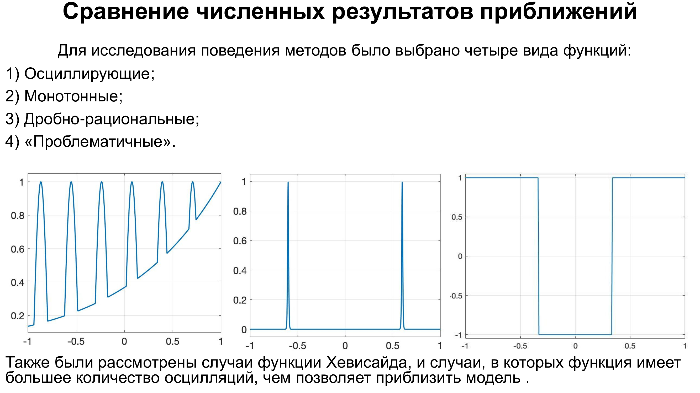

# Методы минимаксной аппроксимации
## Реализация различных методов минимаксной аппроксимации математической функции на языках MATLAB и Python. 
### Список реализованных методов: 
* Классический алгоритм Ремеза
* Дробно-рациональный алгоритм Ремеза
* Барицентрический метод
* Метод дифференциальной коррекции
* Алгоритм DCR2
* Алгоритм AAA-Лоусона
* Базовый и комбинированный методы IRLS

